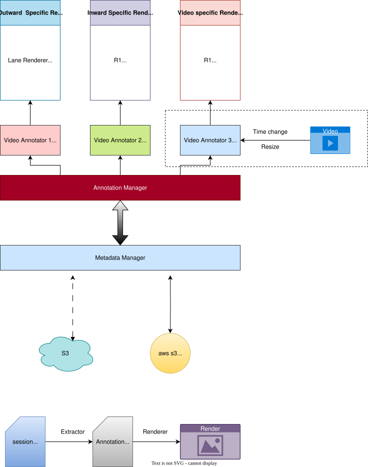

# NeoKPI - Alert Debug Chrome Extension

A Chrome Extension that improves the KPI-Alert Debug page with keyboard shortcuts, note-taking capabilities, bulk processing and quick custom annotations.

# NOTE
- video annotation features are used from markrEdge folder, it has 'konva' based implementation.
- we are not using the video renderers implemented in Neokpi/src/features . it's outdated.

## Rendering Pipeline


## 🎯 Main features
- ⌨️ **Quick keyboard shortcuts** (Cmd+I/J/B for input, notepad, bulk mode)
- 📝 **Note-taking** with auto-save, tags, and video timestamps
- 🔄 **Bulk processing** for handling multiple alerts efficiently  
- 🎥 **Enhanced video controls** with seek, play/pause via keyboard
- 📊 **Data export/import** via CSV for backup and sharing
- 🎯 **Video Annotations** Add your own custom renderers using data from metadata file

## ⚡ Quick Start
Follow these steps to generate the 'chrome-extension'
- If node.js is not installed `brew install node`
```bash
# 1. Clone & Setup
git clone <repository-url>
cd NeoKPI
npm run setup

# 2. Build Chrome Extension
npm run build

# 3. Install in Chrome
# - Go to chrome://extensions/
# - Enable Developer mode
# - Load unpacked from dist/chrome-extension/

# 4. Visit https://analytics-kpis.netradyne.com/alert-debug
# 5. S3 presigner.py file can be downloaded from the extension's pop up.
```

## 📚 Documentation
> Coming soon...

## 🚀 Upcoming Features
- [ ] Automatic caching of alert type
- [x] Make it into a Chrome extension
- [ ] Support multiple datasets (named bulks)
  - [ ] Save to S3, for quick Sharing with others
- [ ] Download the annotated video
  - [ ] Option for the user to choose the opacity of individual annotations
- [ ] Handle SPA navigation properly
  - [ ] Going out/into `alert-debug`
- [ ] Copy the video frame and the annotations onto a single canvas
- [ ] improve settings modal. 
  - [ ] make everything in config available through settings.
- [ ] Create Tests
- [ ] Implement other Renderers


## Known Bugs
- [ ] KPI tools bug:  Video sync: play failed: The play() request was interrupted by a new load request. https://goo.gl/LdLk22
- [ ] old metadata is not cleaned from the pipeline, when the new metadata fails to load.
---
**Author**: Inward Analytics team
